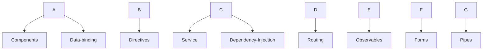

# angular-notes

```mermaid
graph TD;
    A-->Components & Data-binding;
    B-->Directives;
    C-->Service & Dependency-Injection;
    D-->Routing;
    E-->Observables;
    F-->Forms;
    G-->Pipes;
```
